# Archon — AI Dev Team Platform

> **Notice:** This repository contains proprietary software. All rights reserved. See [LICENSE](LICENSE) for terms. Unauthorized use, reproduction, or distribution is prohibited.

> Digital agencies spend 70% of their time rebuilding and re-explaining decisions to clients. Archon solves this by generating complete web apps with a full audit trail — every decision recorded, every version restorable, every build IBM Watson-certified. Agencies close clients faster and reduce revision cycles by showing exactly what was built, when, and why.

A multi-agent platform that converts product ideas into auditable web applications
with full version history. Built for digital agencies and enterprises delivering
client apps to non-technical clients.

**What makes Archon different:**
- **Claude Opus 4.6** powers the Build Agent — generates production-grade full-stack code from natural language
- Every prompt creates a full artifact set: Brief + Plan + Code + live preview
- Complete version history — every decision is auditable and reversible
- Agencies can show clients exactly what was built and why, version by version
- Business language UI — no developer jargon anywhere
- Korean/English language support
- **Claude Vision** scores design quality in the automated eval loop
- IBM Watson governance — every build is scored, audited, and factsheet-certified

**The MOAT:** The Versions page. Competitors show current state only.
Archon shows complete decision history with artifacts and live preview per version.

---

## Demo

[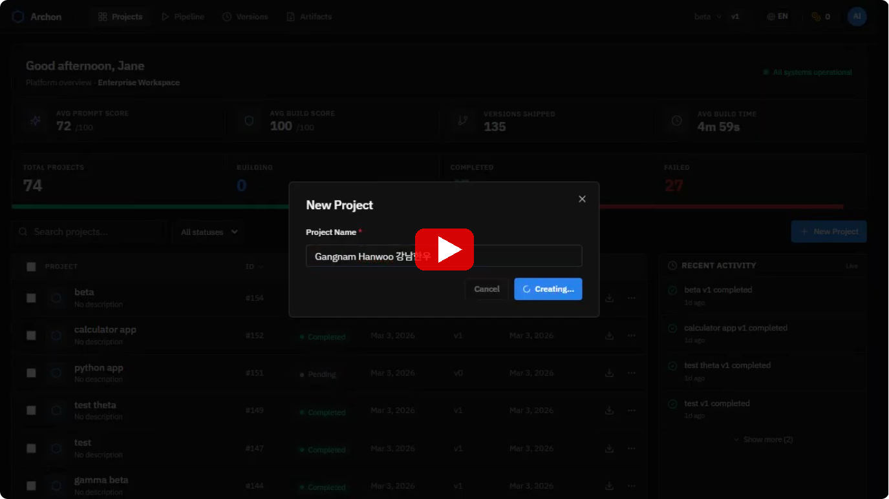](https://youtu.be/ci8xDNnxJKQ)

> Watch the full demo — from prompt to deployed app in under 5 minutes.

---

## Generated Examples

Every app is generated from a single prompt — no templates, no manual coding. Here are examples produced by the platform:

### Crypto Portfolio Dashboard
> Prompt: *"Build a crypto portfolio tracker with real-time prices, holdings table, and activity feed"*

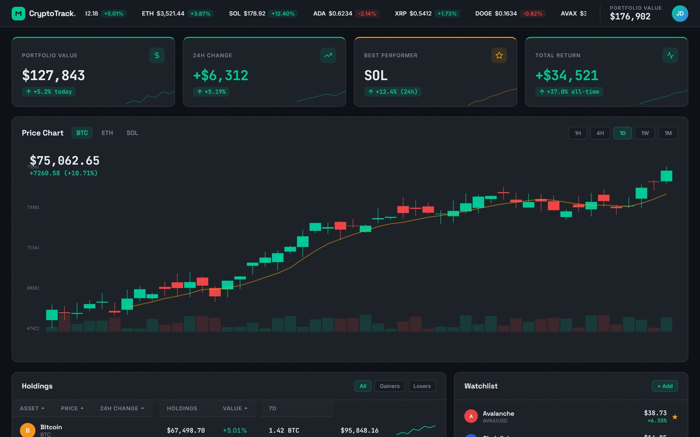

### Final Fantasy VII Fan Page
> Prompt: *"Build a Final Fantasy VII fan page with character profiles, materia system, weapons gallery, and world map"*

[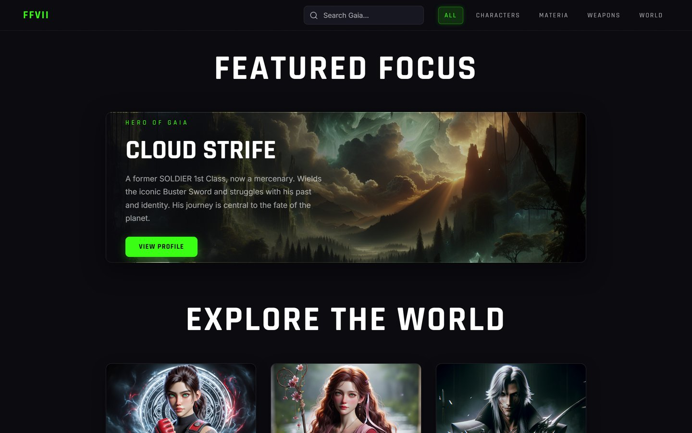](docs/screenshots/game-ff7-full.jpg)

### SaaS Landing Page
> Prompt: *"Build a landing page for an AI-powered writing assistant with features, pricing, and testimonials"*

[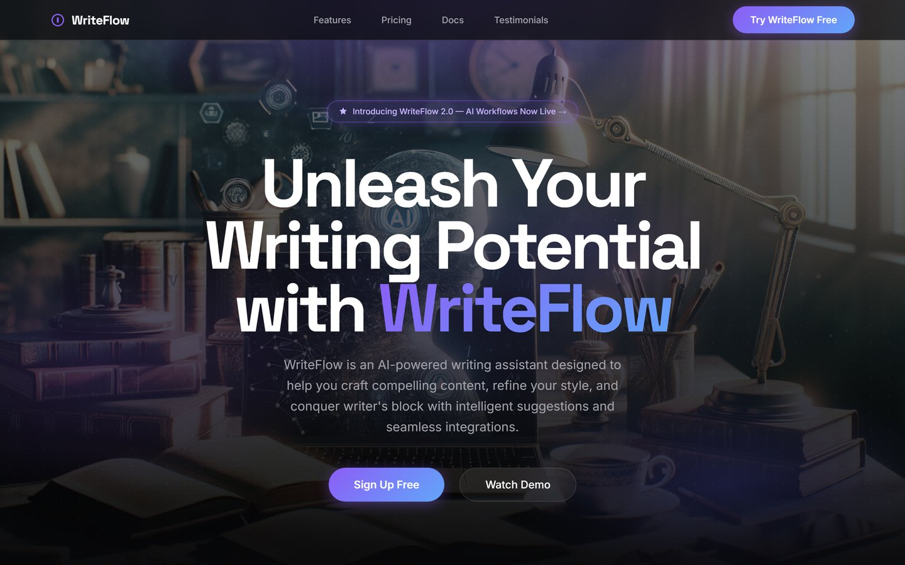](docs/screenshots/saas-writeflow-full.jpg)

### Developer Portfolio
> Prompt: *"Build a creative developer portfolio with project showcase, skills section, and contact form"*

[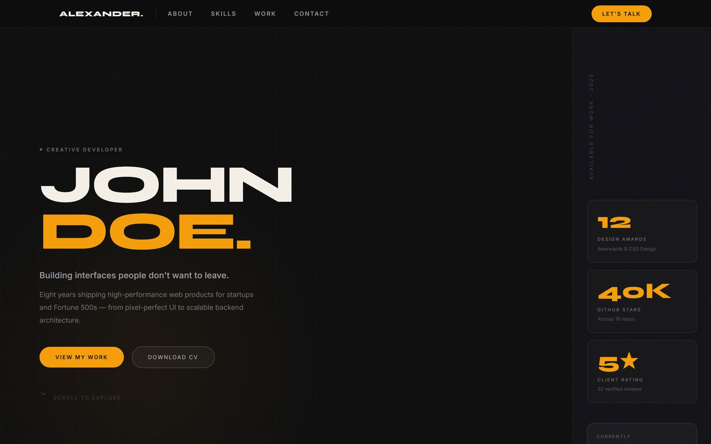](docs/screenshots/portfolio-developer-full.jpg)

---

## Screenshots

<details open>
<summary><strong>Projects Dashboard</strong></summary>

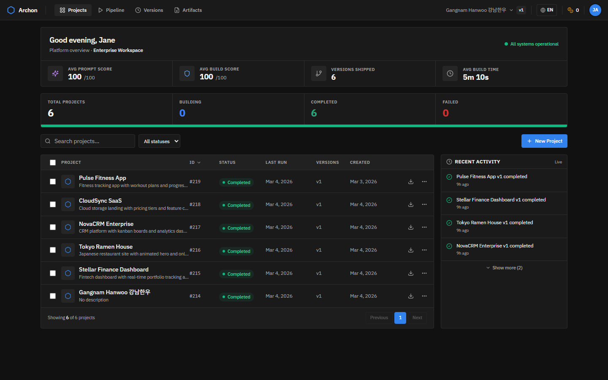
</details>

<details open>
<summary><strong>Multi-Agent Pipeline</strong></summary>

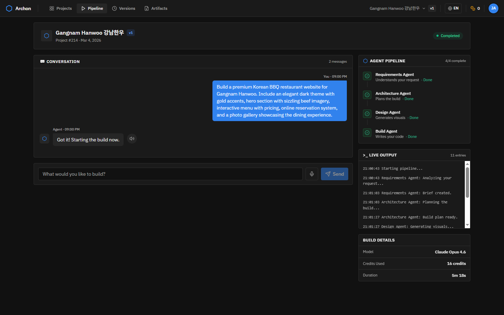
</details>

<details open>
<summary><strong>Versions & Live Preview</strong></summary>

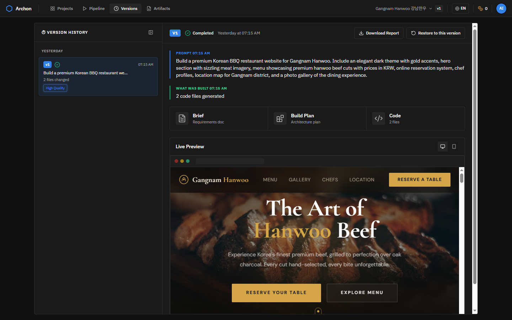
</details>

<details open>
<summary><strong>Artifacts — AI-Generated Brief</strong></summary>

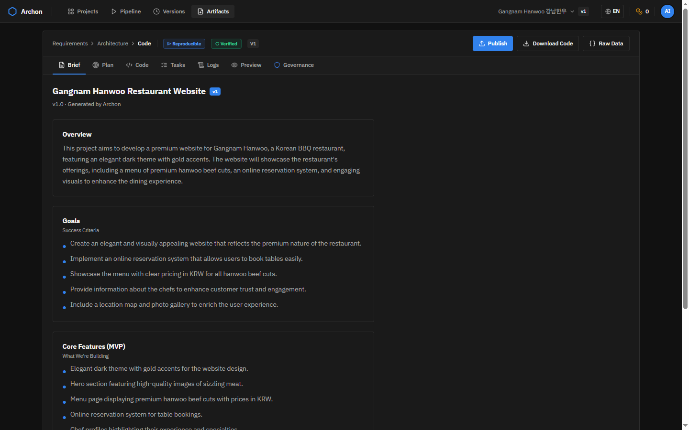
</details>

<details open>
<summary><strong>AI Governance — IBM Watson Factsheet</strong></summary>

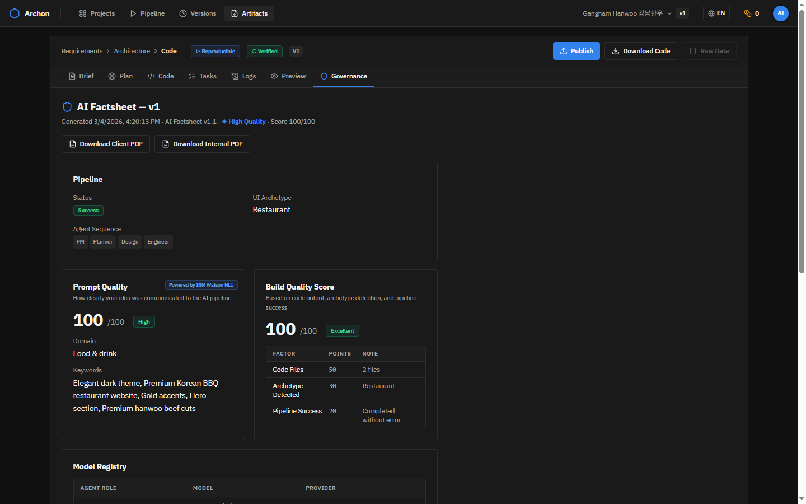
</details>

<details open>
<summary><strong>Consumer Frontend — Prompt Interface</strong></summary>

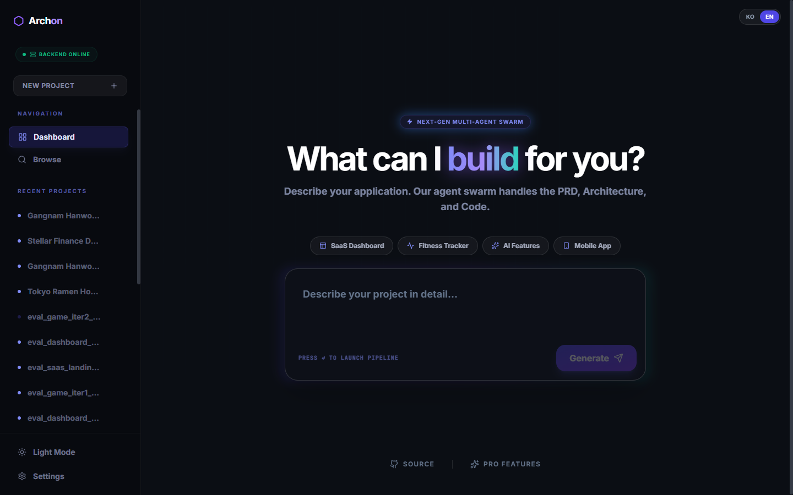
</details>

---

## Architecture
```
User Input (Chat Panel)
    ↓
Watson NLU Pre-Analyzer (IBM Watson NLU — sentiment routing, keyword extraction)
    ↓
Prompt History (context continuation)
    ↓
Requirements Agent (OpenAI GPT-4o)  → Brief artifact (versioned)
    ↓
Architecture Agent (Gemini 2.5 Flash)     → Build Plan artifact (versioned)
    ↓
Design Agent (GPT-4o-mini + DALL-E 3)   → Image assets (versioned, parallel generation)
    ↓
Build Agent (Claude Opus 4.6)            → Code files (versioned)
    ↓
Eval System (Claude Sonnet 4.6)          → Vision-based quality scoring (8 dimensions)
    ↓
Governance Agent (IBM Watson NLU)   → AI Factsheet (scored, versioned, exportable)
    ↓
Execution Result → Database + UI + Version Timeline + Live Preview
```

---

## Quick Start

### Prerequisites
- Python 3.11+
- Node.js 18+
- OpenAI API key
- Anthropic API key (Build Agent — Claude Opus 4.6)
- Google Gemini API key (Architecture Agent)
- IBM Watson API keys (STT, TTS, NLU — optional, degrades gracefully)

### 1. Clone and install
```powershell
git clone https://github.com/aiedwardyi/ai-dev-team
cd ai-dev-team

python -m venv venv
.\venv\Scripts\Activate
pip install -r requirements.txt

cd frontend-studio
npm install
cd ../frontend-consumer
npm install
cd ../frontend
npm install
cd ..
```

### 2. Set API keys (each session)
```powershell
$env:OPENAI_API_KEY = "sk-proj-..."
$env:ANTHROPIC_API_KEY = "sk-ant-..."
$env:GENAI_API_KEY = "your_gemini_key"
$env:WATSON_TTS_URL = "https://..."
$env:WATSON_TTS_APIKEY = "your_api_key"
$env:WATSON_STT_URL = "https://..."
$env:WATSON_STT_APIKEY = "your_api_key"
$env:WATSON_NLU_URL = "https://..."
$env:WATSON_NLU_APIKEY = "your_api_key"
```

### 3. Start the servers
```powershell
# Terminal 1 — Flask backend (port 5000)
.\venv\Scripts\Activate
python backend/app.py

# Terminal 2 — Studio UI (port 3000)
cd frontend-studio
npm run dev

# Terminal 3 — Consumer UI (port 3002)
cd frontend-consumer
npm run dev

# Terminal 4 — Enterprise UI (port 8080)
cd frontend
npm run dev
```

### 4. Open the app
```
Studio UI:      http://localhost:3000
Consumer UI:    http://localhost:3002
Enterprise UI:  http://localhost:8080
```

---

## Frontends

| Frontend | Port | Description |
|----------|------|-------------|
| `frontend-studio/` | 3000 | Studio UI — full admin dashboard, 10 screens, light + dark mode |
| `frontend-consumer/` | 3002 | Consumer UI — chat-first interface, Versions page, Korean/English toggle |
| `frontend/` | 8080 | Enterprise UI — Vite + React + shadcn/ui, 4-theme system, governance dashboard |

All three connect to the same Flask backend on port 5000.

---

## Project Structure
```
ai-dev-team/
├── agents/
│   ├── pm_agent.py           # Requirements Agent (OpenAI GPT-4o-mini)
│   ├── planner_agent.py      # Architecture Agent (Gemini Flash)
│   ├── design_agent.py       # Design Agent (GPT-4o-mini + DALL-E 3)
│   ├── engineer_agent.py     # Build Agent (Claude Opus 4.6, Gemini fallback)
│   ├── nlu_agent.py          # NLU Agent (IBM Watson — sentiment + keyword analysis)
│   └── governance_agent.py   # Governance Agent (IBM Watson NLU — AI Factsheets + scoring)
├── backend/
│   ├── app.py                # Flask API (port 5000)
│   ├── models.py             # SQLAlchemy models (Project, Execution, User)
│   └── database.py           # DB init
├── frontend-studio/          # Studio UI (port 3000)
│   ├── components/
│   └── pages/
├── frontend-consumer/       # Consumer UI (port 3002)
│   ├── pages/
│   ├── i18n.ts               # Korean/English translations
│   └── services/
│       └── orchestrator.ts   # Backend API client
├── frontend/                 # Enterprise UI (port 8080)
│   ├── src/
│   │   ├── components/
│   │   │   ├── WelcomeBanner.tsx    # Dashboard header — Avg Prompt/Build scores
│   │   │   ├── ArtifactsView.tsx    # Governance sub-tab + Factsheet viewer
│   │   │   └── BuildDetailsCard.tsx # Per-build stats (credits, model, duration)
│   │   └── pages/
├── prompts/
│   └── engineer.txt          # Build Agent system prompt
├── schemas/
├── scripts/
│   └── safe_write.py         # Iteration scope enforcement
├── eval/
│   ├── eval_runner.py        # Automated build → screenshot → score → improve loop
│   ├── eval_scorer.py        # Vision-based scoring (Claude Sonnet 4.6)
│   ├── eval_improver.py      # Prompt improvement based on scoring feedback
│   ├── scoring_rubric.py     # 8-dimension quality rubric with archetype criteria
│   ├── screenshotter.py      # Playwright full-page screenshot capture
│   └── eval_config.json      # Eval loop configuration
├── docs/
│   └── screenshots/          # Curated showcase images
├── ROADMAP.md
└── CURRENT_SPRINT.md
```

---

## API Endpoints

| Method | Endpoint | Description |
|--------|----------|-------------|
| GET | `/api/health` | Health check |
| GET | `/api/projects` | List all projects |
| POST | `/api/projects` | Create project |
| GET | `/api/projects/:id` | Get project + executions |
| DELETE | `/api/projects/:id` | Delete project |
| POST | `/api/projects/:id/iterate` | Run pipeline iteration |
| GET | `/api/projects/:id/versions` | Full version history |
| GET | `/api/projects/:id/versions/:v/files` | Get code files for a version |
| GET | `/api/projects/:id/versions/:v/factsheet` | Get AI Factsheet for a version |
| GET | `/api/projects/:id/head` | Get active head version |
| POST | `/api/projects/:id/chat` | Send chat message (NLU pre-analysis + routing) |
| GET | `/api/projects/:id/chat-history` | Get persisted chat messages |
| POST | `/api/executions/:id/restore` | Restore version as active HEAD |
| GET | `/api/execution-status` | Poll live execution status |
| GET | `/api/preview/:project_id/:version` | Serve generated HTML preview |
| POST | `/api/projects/:id/versions/:v/publish` | Publish version to shareable URL |
| GET | `/api/dashboard/stats` | Avg prompt + build scores across all executions |
| GET | `/api/credits/balance` | Current credit balance |
| GET | `/api/prd` | Latest Brief artifact |
| GET | `/api/plan` | Latest Build Plan artifact |
| GET | `/api/code` | Latest execution result |
| GET | `/api/assets/:pid/:version/:file` | Serve design assets |
| POST | `/api/watson/stt` | Speech to text (IBM Watson) |
| POST | `/api/watson/tts` | Text to speech (IBM Watson) |

---

## Key Features

| Feature | Description |
|---------|-------------|
| Versions Page (MOAT) | Timeline + split panel with live preview per version |
| Iteration Mode | Surgical edits with scope enforcement, ancestor chain walk |
| Design Assets | DALL-E 3 images, reused on iterations (no regeneration) |
| Archetype Lock | App type locked after v1, prevents unintended mutations |
| Korean/English | Full i18n support with KO/EN toggle across all UIs |
| Chat Persistence | Messages saved to DB, survive refresh and machine changes |
| One-Click Publish | Shareable hosted URL for any version |
| Watson STT/TTS | Voice input and audio playback in enterprise UI |
| Watson NLU | Pre-pipeline sentiment analysis — frustrated users routed to chat, not build |
| Credit System | 1 credit = 2,500 tokens, usage shown per build and in navbar |
| **AI Factsheets** | **Governance Agent scores every build (prompt quality + build confidence, 0–100)** |
| **Model Registry** | **Factsheet logs every AI model used per version: OpenAI, Anthropic, Gemini, IBM Watson** |
| **Human Review Flag** | **Auto-triggers when prompt or build score < 50** |
| **Dashboard Governance** | **Enterprise header shows live Avg Prompt Score and Avg Build Score across all builds** |
| **Quality Tier Badges** | **Every version card shows High / Good / Low Quality badge based on combined score** |
| **Eval System** | **Automated build → screenshot → score → improve loop with vision-based quality assessment (8 dimensions, archetype-specific criteria)** |

---

## Anthropic Claude Integration

Claude is the core intelligence behind Archon's code generation and quality evaluation.

**Build Agent — Claude Opus 4.6:**
- Primary code generation engine — converts build plans into complete, deployable web applications
- Streaming responses with 64K token output window for complex multi-file apps
- Structured JSON output with 5-pass repair pipeline (handles edge cases in large code generation)
- Retry logic with exponential backoff for rate limits and transient errors
- Gemini 2.5 Flash available as automatic fallback

**Design Eval Loop — Claude Vision (Sonnet):**
- Automated design quality scoring — screenshots evaluated against 8 dimensions (hierarchy, typography, color, layout, polish, data completeness, interactivity, overall impression)
- Reference-based comparison — good/bad example images provided for each archetype
- Prompt rewriting — Claude analyzes scores and rewrites engineer prompts to fix identified issues
- Rollback logic — reverts prompt changes that regress scores
- Target: 90+/100 across all 32 archetypes

**Why Claude:**
- Opus 4.6 produces significantly higher-quality code output than alternatives — fewer generic templates, more domain-specific design decisions
- Vision capabilities enable automated design evaluation without human reviewers
- Streaming support keeps the pipeline responsive for long-running builds

---

## IBM Watson Governance

Archon includes an enterprise-grade AI governance layer powered by IBM Watson NLU.

**How it works:**
1. Every successful build triggers the Governance Agent automatically
2. Watson NLU analyzes the original user prompt — returns a clarity/intent score (0–100)
3. Build confidence is computed from output quality signals: files generated, archetype match, images, code length
4. A structured AI Factsheet is saved per version — to disk and to the database

**What's in a Factsheet:**
- Prompt Quality Score (IBM Watson NLU)
- Build Confidence Score (output quality signals)
- Human Review Required flag (auto-triggered when either score < 50)
- Model Registry — every AI model used: OpenAI (PM Agent), Anthropic Claude (Build), Google Gemini (Architecture), IBM Watson NLU (Governance)
- Compliance flags: data_privacy, bias_check, content_moderation
- Archetype, token usage, build duration

**Dashboard integration:**
The Enterprise dashboard header shows live averages across all builds:
- Avg Prompt Score (purple Sparkles icon)
- Avg Build Score (blue Shield icon)
- Pre-governance builds show "—" (not zero)

**Quality Tier system:**
After every build, Archon computes a combined score from Prompt Quality + Build Confidence and assigns a Quality Tier:
- **High Quality** (85–100) — build meets the quality standard, shown in blue on the Versions timeline
- **Good Quality** (60–84) — solid build with room to improve, shown in green
- **Low Quality** (0–59) — consider rebuilding with a more detailed prompt, shown in red

The tier badge appears on every version card in the Versions timeline — so non-technical founders and agency owners can instantly see which versions are ready to present, without reading scores or technical details.

A prominent banner also appears at the top of the Governance tab with plain-English messaging matched to each tier.

**Resume/portfolio value:** Governed, auditable AI pipelines with IBM Watson scoring — rare even among senior IBM AI Engineers.

---

## Roadmap Summary

| Phase | Status | Description |
|-------|--------|-------------|
| 1–6.4 | ✅ | Core pipeline, UI, enterprise design |
| 7A-7H | ✅ | Iterative pipeline, live preview, stability, output quality, chatbox |
| 8.1 | ✅ | One-click publish |
| 10.1-10.2 | ✅ | Watson STT/TTS |
| 10.4 | ✅ | App type lock (archetype guardrail) |
| 12.1 | ✅ | Domain personality upgrade (25 archetypes) |
| 13 | ✅ | Chat persistence + user model |
| 14 | ✅ | Iteration mode fixes |
| 15 | ✅ | Consumer frontend v2 |
| 15.4 | ✅ | Enterprise UI (frontend, shadcn/ui) |
| 16.1 | ✅ | Bug fixes — chat persistence, JSON repair, build lock |
| 16.2 | ✅ | Branding — hexagon logo + favicon across all UIs |
| 16.3 | ✅ | Studio feature parity — sort, i18n, build details |
| 16.4 | ✅ | Watson STT/TTS for Enterprise UI |
| 17.1 | ✅ | Watson NLU pre-pipeline analyzer |
| 17.2 | ✅ | Governance Agent — AI Factsheets + Watson NLU scoring |
| 17.3 | ✅ | Dashboard governance metrics (Avg Prompt + Build scores) |
| 17.4 | ✅ | Dual PDF export — Client PDF + Internal PDF |
| 17.5 | ✅ | Delivery Readiness Gate — Quality Tier badges (High/Good/Low) on Versions timeline |
| 16.5 | ✅ | Authentication — JWT, Google OAuth, blacklist logout, concurrent pipeline |
| 18 | 🔴 | Unified auth + plan-based UI routing |
| 8.3 | 🔴 | Client shareable read-only link |

---

## License

Copyright (c) 2025-2026 Edward Yi. All rights reserved. See [LICENSE](LICENSE).
